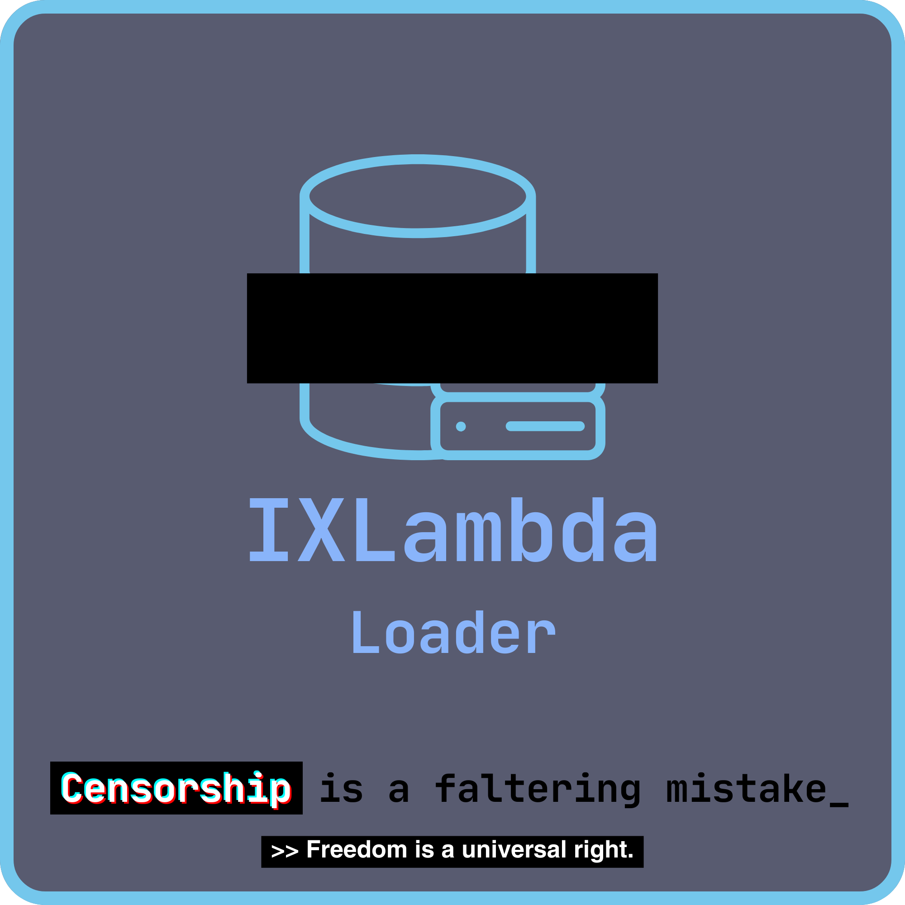

<p align="center">
  </img>
  <br>
  
  
</p>

# IXLamba Loader
## IXLambda is a dynamically loaded bookmarklet to load a GUI with proxies and links.
Pronounced "Eye-X-Lamb-Duh"

Copy the code below and paste it into a bookmark to begin.
```js
javascript:(function()%7Bvar%20script%20%3D%20document.createElement(%22script%22)%3B%0Ascript.src%20%3D%20%22https%3A%2F%2Fraw-githack-com.translate.goog%2FAugtive85YT%2FPhiPiBeta%2Fmain%2FIXLambda%2Fmain.js%22%3B%0Adocument.head.appendChild(script)%3B%7D)()
```
### Brought to you by ΦΠΒ's owner, SUDO.
Updates may be pushed at any time, that is intended.
